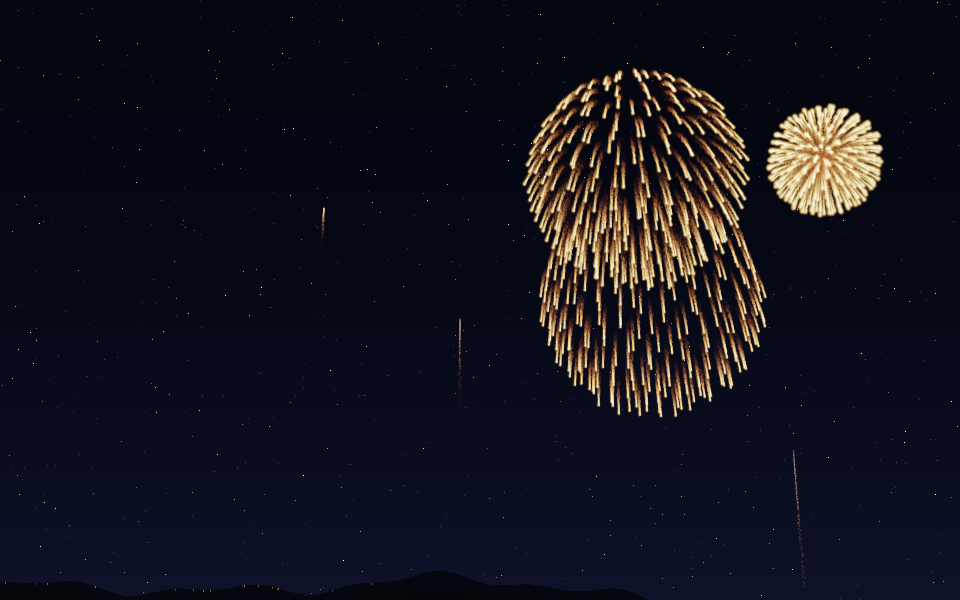
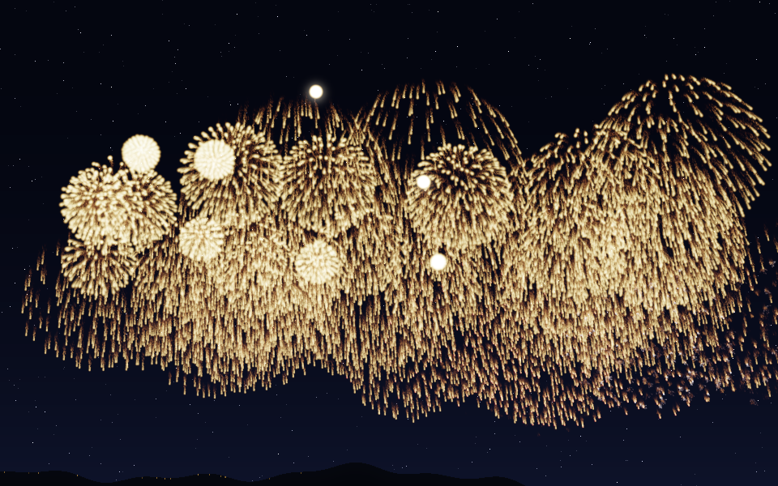
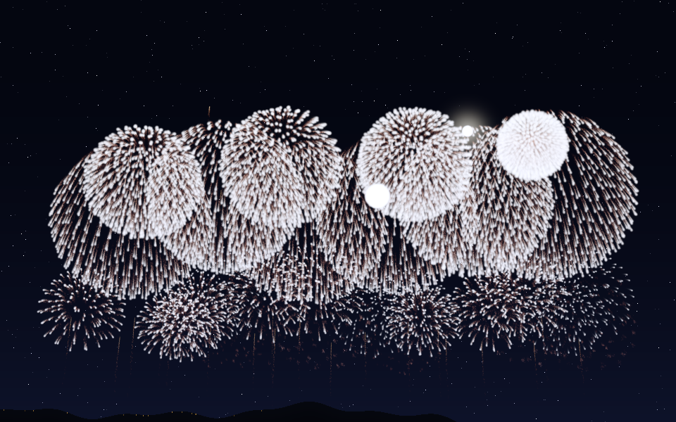

# hanabi_emu_cpp

打ち上げ花火（菊）のシミュレータ。**本物の花火玉に詰まっている「星」を一つ一つ**計算します。
計算も描画もすべて C++（レンダリングは [olive.c](https://github.com/tsoding/olive.c) と自前の HDR 加算バッファ）で、
Emscripten で WASM にして走らせます。作りは [universe_cpp](https://github.com/yomei-o/universe_cpp) と同じ ABI・同じハーネス。

## ▶ WASM デモ

### **https://yomei-o.github.io/hanabi_emu_cpp/wasmdist/hanabi_os/**

**🎆 スターマイン**ボタンで花火大会のクライマックス（既定 100 連発）。
**放っておいても 2 分おきに勝手に始まります**（間隔はスライダで変更、0 で自動オフ）。
クリックでその位置から 1 発打ち上げ。**⛶ フルスクリーン**（または F キー）で
文字を全部消して花火だけの全画面に。


## 何をシミュレーションしているか

入力は**火薬が与える初速と導火線の秒時だけ**です。到達高度も開花直径も、
表から読んだ値ではなく**毎ステップの差分計算（積分）の結果として出てきます**。
解析解も逆算ソルバも使っていません（アニメーションなので全部逐次差分）。

### 1. 打揚（うちあげ）
臼砲の打揚薬が玉に初速 v₀ を与える。以後は球体としての二次空気抵抗＋重力で減速：

```
F = -½ ρ Cd A |v| v  - m g ŷ
k = ½ ρ Cd A / m                      (弾道係数, 玉は燃えないので一定)
v ← v + (-k|v|v - g ŷ) dt,   x ← x + v dt
```

昇り曲導の火の粉を曳きながら上がり、**到達高度は積分の結果**（5号で実測 233m）。

### 2. 開発（かいはつ）
**時限導火線**が `fuse ← fuse - dt` で焼け、0 になった瞬間に割薬が働く。
実物と同じく必ずしも頂点ちょうどではなく、少し手前／少し後ろでも開く。

### 3. 星（ほし）
玉皮の内側に一層（芯入りなら多層）詰められた星が球面状に飛散。
方向は**フィボナッチ球**で等方に配り、玉ごとにランダム回転、初速には数 % のばらつき（玉込めの誤差）。

星は**表面燃焼**するので半径 r が線形に減り、質量・断面積・弾道係数が刻々変わります：

```
m = ρs (4/3)π r³,  A = π r²
k = ½ ρ Cd A / m = 0.8636 / (4 ρs r)     ← r に反比例して増える
r ← r - (r₀/T_burn) dt
```

**小さくなるほど急減速する**——これが菊の「勢いよく開いて、止まって、垂れる」形を作ります。
輝度は燃焼表面積 (r/r₀)² に比例させているので、消え際が自然に暗くなります。

### 4. 引先（ひきさき＝尾）
菊の尾は、星から剥がれ落ちて燃えている燃えかすそのもの。**実粒子として飛ばしています**。
半径 0.3mm 程度の粒は k ≈ 0.3 と抗力が桁違いに大きく、放出直後にほぼ空気に対して静止し、
その場で燃えながら重力でゆっくり垂れる。これが空間に軌跡として残ります（1発あたり数万粒）。

### 5. 風
風は「一様に横から吹く」のではありません。地面の摩擦が効くので**下ほど遅く、上ほど速い**。
大気境界層のべき乗則 `U(y) = U₁₀ (y/10)^0.20` を入れてあります（300m で地上10mの約2.0倍）。
さらに上へ行くほど摩擦が抜けて**向きも振れます**（エクマン螺旋）:
`θ(y) = 0.42 (1 - exp(-y/220))`。玉は上ほど流され、開いた花は斜めに流れながら崩れます。
スライダの風速は**地上10mの値**（気象の観測値と同じ約束）。突風もゆっくり息をします。

### 6. 煙
**火薬が燃えて出た煙そのもの**を粒として持っています。式は素直で、

- 空気に引きずられる受動的なトレーサ。速度は緩和時間 0.85s で風に収束
- 出たては熱いので浮力で上がり、冷めるにつれ浮力が抜ける
- 巻き込みで膨らむ。**質量は保存される**ので柱密度は `m/(πr²)`
  ＝ **光学的厚さ τ は半径の2乗で薄まる**

膨らみ方は2段です。星は 70m/s で飛びながら燃えているので、置いていかれた煙は**激しい後流の中**
にあり最初の数秒は速く広がり、後流が収まるとあとは大気のふつうの乱流拡散でゆっくり広がるだけ。

**1発だけだと煙はほとんど見えません。** 5号1発の煙（約250g）を直径200mの花いっぱいに広げると
τ ≒ 0.05 でほぼ透明だからです。連打すると 25kg ぶんが同じ空にたまるので τ が数になり、
**空が本当に霞みます**。数字がそのまま出ているだけで、細工はしていません。

### 7. 描画
粒子は float の HDR 加算バッファに加算合成し、トーンマップして夜空に合成。
残光（バッファの減衰率）はスライダで調整可。カメラはピンホール投影で、
地平線が画面下端・花の頂点が画面上端に来るよう焦点距離とピッチ角を号数から決めます。

煙は低解像度（1/6）に落として描きますが、1枚だと「手前の煙か奥の煙か」が分からず
奥の花火だけを霞ませられません。そこで**奥行きで6枚のスラブに分け**、光る粒を撒くときに
その粒より手前にある煙の透過率を掛けています。夜空は無限遠なので全部ぶんが掛かります。
煙自身の明るさは**単散乱の近似**で、画面の光を大きくぼかしてから不透明度 `1-T` を掛けたもの。
ぼかしが足りないと「光っている所の煙しか光らない」＝花火の輪郭が煙にそのまま写るだけになります。

トーンマップは**ボタンで2つの式を切り替えられます**。
「キラキラ」（既定）は最大成分だけ `mx/(1+mx)` で圧縮して**色の向きを保つ**もの、
「落ち着いた」は成分ごとの `r/(1+r)` で、明るい芯からクリーム色〜白へ抜けるもの。

### 8. 玉の種類

**見た目を描いているのではなく、星に与える物理量と配置を変えているだけ**です。

| 玉種 | 星初速 | 燃焼時間 | 剥離量 | しくみ |
|---|---|---|---|---|
| 菊 | ×1.0 | ×1.0 | ×1.0 | 基本形。長い引先を曳く |
| 牡丹 | ×1.10 | ×0.75 | ×0 | 尾なし。点の集まりで開く |
| 柳 | ×0.48 | ×1.95 | ×1.7 | 低速・長燃焼で垂れ下がる |
| **蜂** | ×0.50 | ×1.45 | ×0.85 | 噴射の向きが回る。自転が遅いので軌跡が振り回される（下記） |
| **渦蜂** | ×0.90 | ×0.80 | ×3.60 | 割れて1〜2秒後にノズルが点火し、噴射が360°回りながら飛ぶ |
| **千輪** | — | — | — | 星ではなく**子玉**を撒き、遅れて一斉に小さく開く |
| **型物** | ×1.0 | ×0.68 | ×0.24 | 星を**観客を向いた平面に形どおり**並べる |
| **錦冠(金冠)** | ×0.40 | **×2.30** | **×2.20** | 柳の親玉。10秒級の長燃焼で地面近くまで垂れる |

#### 蜂・渦蜂 — 彗星のように噴射して、その反作用で飛ぶ
どちらも**ノズル付きの星**です。機体が自転しているのでノズルの向きが 360° 回り、
噴射の反作用の向きも一緒に回る。**軌跡は押しつけず、力を積分した結果として出しています。**

```
n̂(θ) = u cos θ + w sin θ       ← ノズルの向き(u ⊥ w ⊥ 自転軸)。軸まわりに360°回る
θ ← θ + ω dt                    ← 機体の自転
dω/dt = -B |ω| ω                ← 自転は空気抵抗で落ちる
a += (T r/r₀) n̂                 ← 噴射の反作用。燃え尽きるにつれ推力も落ちる
火の粉の速度 = v_star - v_ex n̂   ← 噴射そのもの。ノズルの反対向きに出る
```

この積分の結果として、速度は振幅 `a/ω` で振れ、位置は半径 `a/ω²` の輪を描きます。
つまり**自転が速いほど軌跡の輪は小さくなる**。ここが2種類の違いです。

- **蜂** — 自転が遅い（0.1〜1回転/秒）ので `a/ω²` が大きく、推力が軌跡そのものを振り回す。
  星ごとに軸・推力・速さがバラバラで、思い思いの方向へクルクル飛んでいく。
  星数は少なめ（×0.38）にして1本1本の軌跡を見せる。


- **渦蜂** — 自転が速い（3〜5回転/秒）ので `a/ω²` は 2m 程度と小さく、**ほぼ直進する**。
  代わりに**噴射だけが 360° ぐるぐる回る**ので、噴射の火の粉が星のまわりにリングを描く。

渦蜂にはもうひとつ大事な性質があります。**割れた直後は回りません。**
割薬で飛び出してから 1.0〜1.9 秒は普通の星としてまっすぐ飛び、そこでノズルに火が回って
回り始めます（`spinDelay`）。開いた瞬間はただの放射状で、1〜2秒経ってから一斉に回り出す。

自転軸は**星ごとに 3D でランダム**（玉に詰められたときの向きがバラバラだから）。
なので投影すると、正面を向いた星は丸いリング、横向きの星は潰れた楕円や短い線になります。

自転が速いと 1 サブステップ（1/240 秒）で位相がかなり進むので、噴射の火の粉は
**そのサブステップ内の円弧上に位相を補間して撒いて**います。これをやらないと軌跡が点線になる。


#### 千輪
親玉が開くと星の代わりに **9+4×号数 個の子玉**を球面状に撒く。子玉は 1.5〜2.0 秒の短い秒時を
焼きながら小さな尾を曳いて飛び、散らばったところで一斉に小さな菊／牡丹になる。
子玉も同じ `Shell` 構造体で、親と同じ積分器をそのまま通る（`gen` で世代を区別するだけ）。


#### 型物（ハート・輪・土星）
星を球面ではなく、玉の中の平面上に形の輪郭どおりに並べ、**中心からの距離に比例した速度**で
押し出す。形はそのまま相似に拡大していく。外側の星ほど速いので抗力で少しだけ形が崩れるのも実物と同じ。
土星は「3Dの小さな球（銀）＋寝かせて傾けた輪（金）」の組み合わせ。

**平面の向きは玉ごとにランダムに傾けてあります。** 型物は玉の中で向きが固定されている一方、
玉自体は飛びながら回っているので、実物も開く向きは制御しきれません。いつも正面を向くのは嘘になる。
面内の回転（絵の傾き）はランダム、そこからランダムな軸まわりに **10〜48度** 傾けています
（真横を向くと線にしか見えないので、傾きには上限を置いています）。
なので同じハートでも、正面に近いもの、斜めに寝たもの、かなり潰れたものが混ざります。


#### 錦冠（金冠）
柳をうんと強くしたもの。低速（×0.40）・超長燃焼（×2.30 ≒ 10秒）・剥離最大（×2.20）で、
金の簾が地面近くまで垂れ下がります。**燃焼の最後の1割だけ紅に変わる**（菊先紅）のが見せ場で、
`chg = 0.90`、`c1 = 紅` の2行で出ます。



**一番重い玉です。** 1発あたりの火の粉は菊の約5.4倍（菊 11,000 粒に対して 59,000 粒）。
それでも 100 連発は通ります — 粒子予算に対する負荷から引先の量を自動調整する仕組みが
上限を押さえるので、**コストは頭打ち**になります。実測（ネイティブ、780フレーム）:

| | 火の粉 | 引先の密度 `qual` | 1フレーム |
|---|---|---|---|
| 菊 100連発 | 43万粒 | 0.52 | 5.9 ms |
| **錦冠 100連発** | 50万粒 | **0.23** | **6.0 ms** |
| 錦冠 100連発（予算を120万に） | 96万粒 | 0.46 | 9.2 ms |

つまり**速度ではなく密度で払っている**わけです。錦冠は要求密度がもともと高いので、
半分に間引かれても十分濃い（実効の剥離レートは菊とほぼ同じ 60粒/秒/星に収束する）。
フル密度で出せるのは同時 9〜10 発ぶんまで。



そのほか、**芯は少し遅れて点火**（時差開発。飛んではいるが光らない暗飛行の時間を持つ）、
一部の玉は**消え際に分砲**（パチパチ）します。

### 9. スターマイン（早打ち連打）

スターマインは発数を装填して連打間隔を差分で消化するだけ。左右に掃引しながら小玉主体で上げ、
時々大玉、締めに大玉の菊が中央で開きます。秒時（時限導火線）にばらつきを持たせているので開発高度も揃いません。

連打が終わったら**余韻**。空に玉も星も無くなるのを待ち、そこから静寂の秒数（既定6秒）を数えてから
通常の単発に戻ります。締めの大玉が開ききる前に次が上がってしまわないように。

**自動スターマイン**（既定2分）。時計が進むのは**通常時だけ**で、連打中と余韻のあいだは止まります。
つまり間隔は「静かな時間の長さ」で測られるので、連打が長引いても次までの間が詰まりません。
おまかせなら毎回テーマが変わります。

#### テーマ
**1テーマ = 1種類**に揃えます。菊とハートが混ざると濁るので、揃えたほうが美しい。
「おまかせ」も混成ではなく、**連打を始めるたびにテーマを1つ引く**（1発ごとではなく連打ごとに確定）。

| テーマ | 中身 |
|---|---|
| 🎲 おまかせ | **打ち上げるたびに下から1つをランダムに選ぶ**（全種類を混ぜはしない） |
| 菊 | 色とりどりの菊だけ 100発 |
| 🌸 桜 | **ピンクの菊だけ** 100発 |
| 銀世界 | 銀の菊だけ 100発 |
| 牡丹 / 金の柳 | それぞれ 100発 |
| 蜂 / 渦蜂 | それぞれ 100発 |
| 千輪 | 100発（子玉が 250 個以上同時に開く） |
| 型物 | ハート・輪・土星をランダムに 100発 |
| 🏅 錦冠 | 金の簾が空一面に垂れる。一番重い（上記） |
| 🔥 **フェニックス** | 長岡まつりの復興祈願花火。**銀冠の大玉を横一列＋低い位置に小玉を同時開花**（下記） |

締めの大玉もテーマに従うので、桜なら最後は大きなピンクの菊で終わります。


#### フェニックス（長岡）
大玉を横一列に並べて開かせ、**その手前の低い位置に小玉を同時に開かせる**テーマ。
号数スライダを 10（尺玉）にすると写真に近くなります。

肝は「同時に開かせる」ところで、**大玉と小玉は号数が違うから秒時も違う**。
同時に撃つと開くタイミングがずれてしまうので、**予約発射**（`Pending`。`t -= dt` で焼ける）を用意して、
開発までの時間の差だけ小玉を遅らせて撃っています。

```
小玉の遅延 = 大玉の秒時 - 小玉の秒時×0.45
```

小玉は秒時を 0.45 倍にして頂点よりだいぶ手前で開かせる＝低い位置に出す。
大玉のほうも号数と秒時を少しずつ散らして、高さと大きさを揃えすぎないようにしています。



粒子予算に対する負荷から引先の量を一次遅れで自動調整するので（これも差分式）、
何発打っても破綻せず、密度だけが緩やかに落ちます。100 連発のピークで星 5,000 個・火の粉 40 万粒ほど。

## 星は尾を引くものと引かないものがある

実物の花星には、炭を含んで火の粉を曳きながら燃える星（**菊**の引先）と、曳かない硬い色星
（**牡丹**・**型物**）があります。ここは加算バッファ（残光）の持ち方で決まります。

```
acc  — 毎フレーム減衰させて溜める = 尾を引く     (菊・柳・錦冠・蜂・千輪の子玉)
accN — 毎フレーム消す              = 尾を引かない (牡丹・型物)
```

バッファが1枚だけだと、**どんな星でも星自身の光が残光として残って長い筋**になります
（火の粉をゼロにしても筋が出たので、尾の正体は火の粉ではなくこれでした）。

ただしこの2枚は**明るさが揃いません**。`acc` は毎フレーム `p_glow` 倍して溜めるので、
その場に留まる光源は `1/(1-p_glow)` 倍 — 既定の 0.82 なら **5.6倍**まで積み上がります。
`accN` は毎フレーム消すので 1倍のまま。同じ光度で撃っていたので、開ききって速度が落ちた頃には
菊が牡丹の5倍明るいことになっていました（「牡丹だけ暗い」の正体）。
いまは `accN` 側に `1 + 0.55×(1/(1-p_glow) - 1)`（既定で約3.5倍）を掛けて補正しています。
丸ごと足さないのは、動いているぶん残光は筋に散るからです。

**型物（ハート・輪・土星）は星が少なくて大きい。** 菊と同じ星数を輪郭に並べると点が細かすぎて
「光る細線」になります。実物は数十個の大きな星を輪郭に置きます（そうしないと形が保たない）。
星数を 0.18 倍、半径を 2.4 倍にしました。大きい星は弾道係数 `k = 0.8636/(4ρs r)` が小さい
＝減速しにくいので、形が崩れにくく遠くまで開きます（実物が大きい星を使う理由でもあります）。
描画の星頭も半径に比例させました（ピークの明るさは同じなので、総光量は半径の2乗
＝燃焼表面積に比例します）。

## 何が上がるか / どんな色か

スターマイン以外の普通の打ち上げは、**菊と牡丹が主**で、ほかはたまに混ざります
（菊42% 牡丹28% 柳8% 千輪6% 蜂5% 渦蜂4% 型物7%）。テーマ付きのスターマインは
そのテーマの玉・その色だけを上げるので、混ざって濁りません。

色は**二色に変わる菊（変化菊）が基本**です（変化菊45% 単色25% 芯替わり20% 金一色10%）。
金一色（錦）を厚くすると上がる玉のほとんどがオレンジに見えてしまうので、見せ場に混ぜる程度に
してあります。

**変化菊の取り合わせは適当な2色ではありません。** 星は層になっていて外側から順に燃えるので、
作り手が組んだ対でしか変化しません。実際に使われるものを表で持っています:

```
銀→紅（最多） 紅→銀 緑→紅 青→銀 黄→紅 紫→銀 金→紅（菊先紅） 銀→緑 紅→金
```

単色の玉に使う炎色も、紅・銀・緑・青を厚く、黄と紫を薄く重み付けしています。

## 消え際のパラパラ（分砲）

星の芯にクラッカー剤を仕込んだ玉は、燃え終わりに細かく爆ぜます。**玉ごとに決まります**
（1つの玉の星は同じ組成なので、パラパラする玉とそうでない玉に分かれる。実物も同じ）。

- **型物** は形が読めなくなるので入れません
- **蜂・渦蜂** は推進が主役なので入れません
- **錦冠** は金の簾の先で一斉に爆ぜる「先パラ」が定番の見せ場なので、割合を 2.25 倍にします
- 割合はスライダ（`sim_set(14, 0〜1)`、既定 0.20）。1.0 にすると（上の除外を除いて）全部パラパラ

## 乱数の種

`sim_init(seed, 0)` の **seed に 0 を渡すと時計から種を撒きます**（ブラウザは毎回ちがう花火）。
非 0 ならその値が種になり、何度でも同じ絵が出ます。ネイティブ自己テストは種を固定してあるので、
**変更の前後を絵の一致で確かめられます**（「この玉種は1ドットも変わっていない」を機械的に言える）。

## 実測値（積分の結果）

| 号数 | 玉径 | 打揚初速 | 秒時 | 星初速 | 到達高度 | 開花直径 | 星数 |
|---|---|---|---|---|---|---|---|
| 3号 | 90mm | 105 m/s | 5.0s | 60 m/s | 約 170m | 約 120m | 91 |
| 5号 | 150mm | 108 m/s | 5.8s | 72 m/s | 233m | 187m | 216 |
| 10号(尺) | 300mm | 116 m/s | 7.6s | 104 m/s | 約 340m | 約 320m | 700 |

到達高度・開花直径は HUD にリアルタイムで実測表示されます。

## ビルド

```sh
EMSDK=~/emsdk ./build.sh hanabi_os        # -> wasmdist/hanabi_os/sim.js (+.wasm)
```

ネイティブ自己テスト（PNG を書き出す）:

```sh
clang++ -O3 -std=c++17 -I. src/hanabi_os.cpp -o hanabi   # C99 指定初期化子のため g++ ではなく clang
./hanabi 600 preview.png          # 単発
./hanabi 620 climax.png 100       # 4番目の引数 = スターマインの発数
./hanabi 500 uzu.png 0 4          # 5番目 = 玉の種類(-1おまかせ 0菊 1牡丹 2柳 3蜂 4渦蜂 5千輪 6♡ 7輪 8土星 9錦冠)
./hanabi 640 sakura.png 100 -1 2  # 6番目 = スターマインのテーマ(2=桜)
./hanabi 640 gin.png 100 -1 3 0 0 # 7番目 = 自動連打の間隔 / 8番目 = 0 で HUD の文字なし
./hanabi 720 ph.png 100 -1 11 0 0 10  # 9番目 = 号数(フェニックスは尺玉で)
./hanabi 900 smk.png 100 -1 1 0 0 5 1 4 1 1  # 10番目=光り方 11番目=風速 12番目=煙 13番目=風プロファイル
```

Windows の clang は `M_PI` が既定で出てこないので `-D_USE_MATH_DEFINES` を足してください。

## 見る

```sh
cd wasmdist && python3 -m http.server 8000
# http://localhost:8000/hanabi_os/
```

クリックでその位置から打ち上げ。スライダで号数・星の数・芯の数・打上間隔・風速・**煙の量**・
引先の量・残光・連打の発数/間隔/余韻・自動スターマインの間隔を調整。
ボタンで**光り方（キラキラ／落ち着いた）**と**風の高度プロファイル（ON／OFF）**を切り替えられます。

煙と風のプロファイルはどちらも**実行時に切れます**（煙はスライダを 0 に）。
100連発・火の粉40万粒という最重条件での実測は、両方 OFF が 24.9ms/フレーム、
風だけ ON が 26.6、両方 ON が 31.2（clang -O3、変更前は 24.1）。
単発では煙の粒が数百なので差は出ません。

fps が落ちても経過時間ぶんだけ物理を進める（描画は1回、最大3ステップ/フレーム）ので、
連打中でもスローモーションになりません。

## ABI

universe_cpp と共通：`sim_init / sim_w / sim_h / sim_reset / sim_step / sim_render / sim_click / sim_set / sim_action`
に、状態を返す `sim_get(id)` を足しています。
JS 側は C++ が描いた RGBA バッファを `ImageData` で canvas に転送するだけ。

## ライセンス

- `olive.c` — MIT (tsoding/olive.c)
- `stb_image_write.h` — public domain
