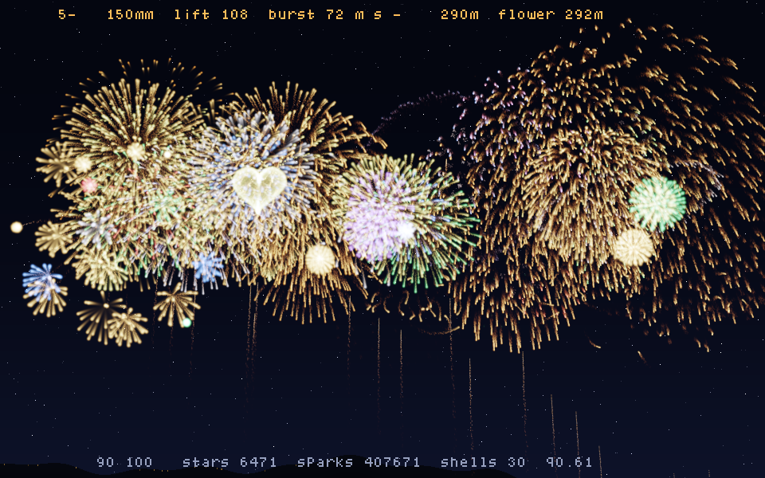
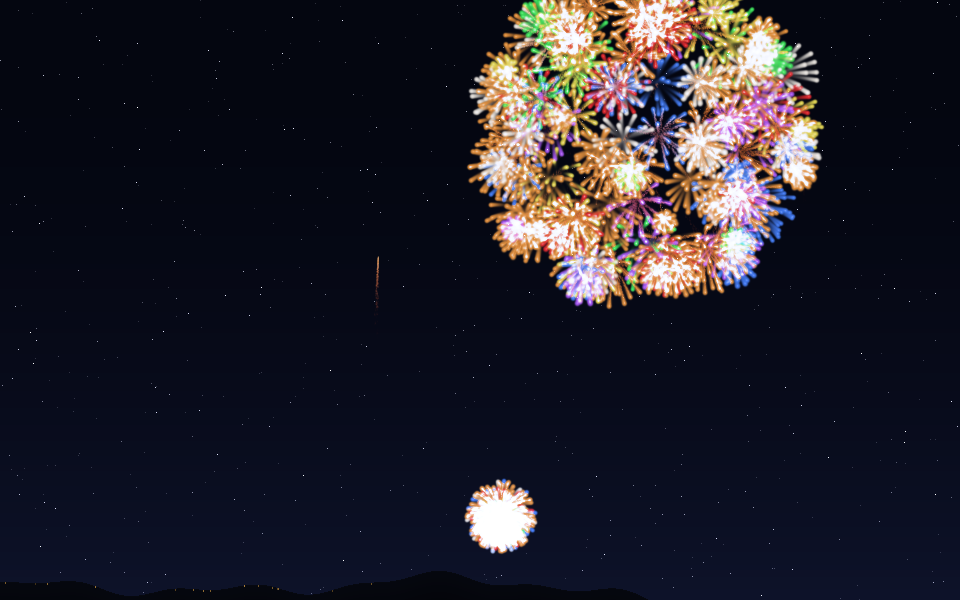
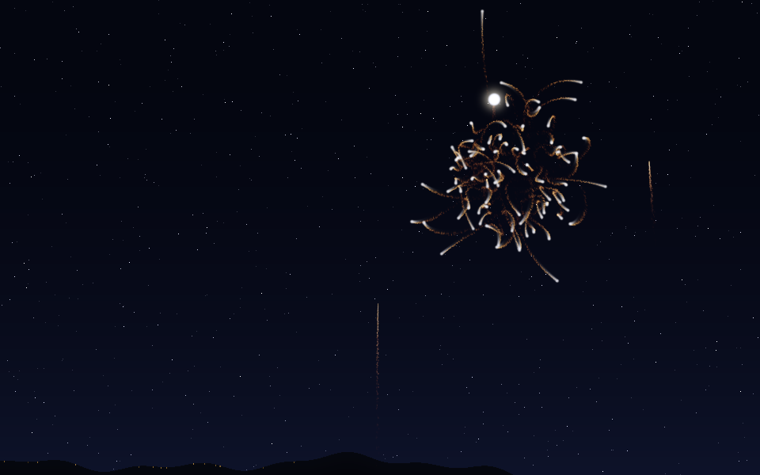
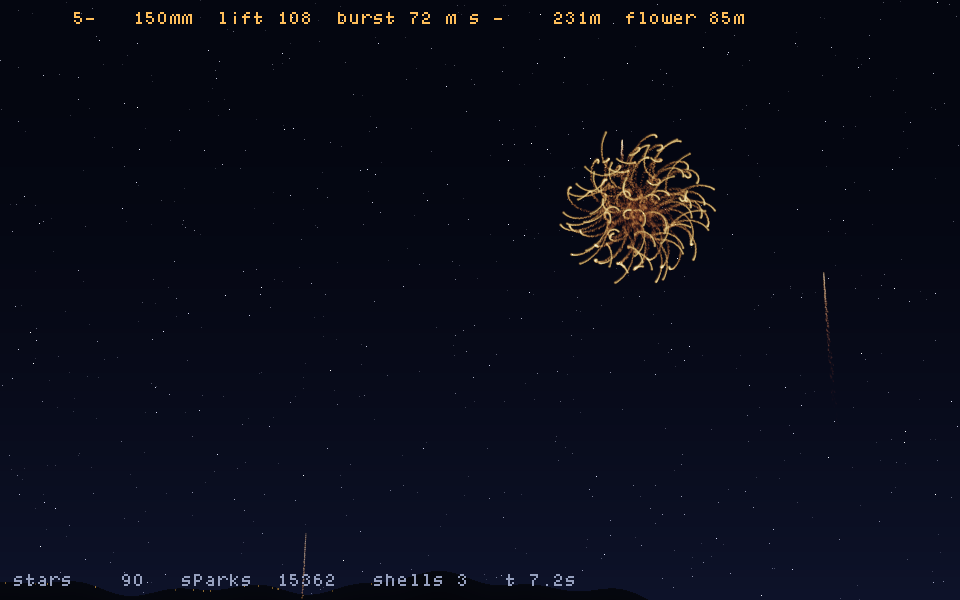
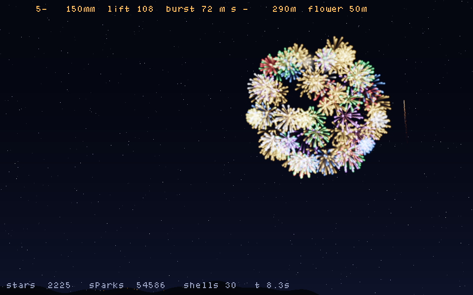
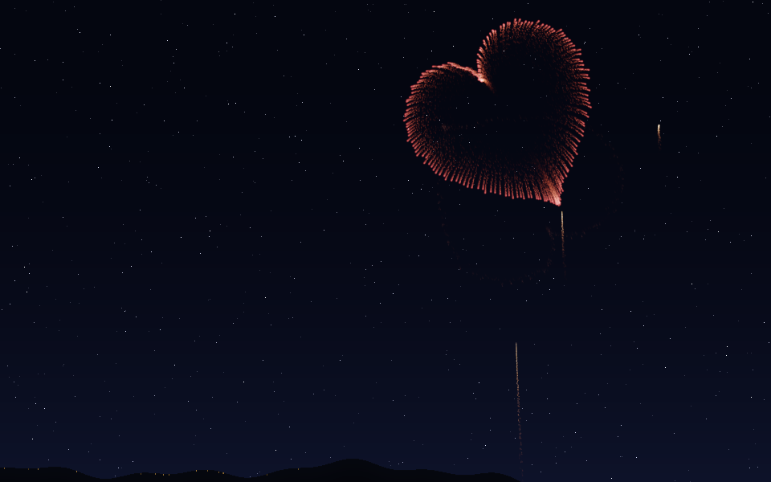
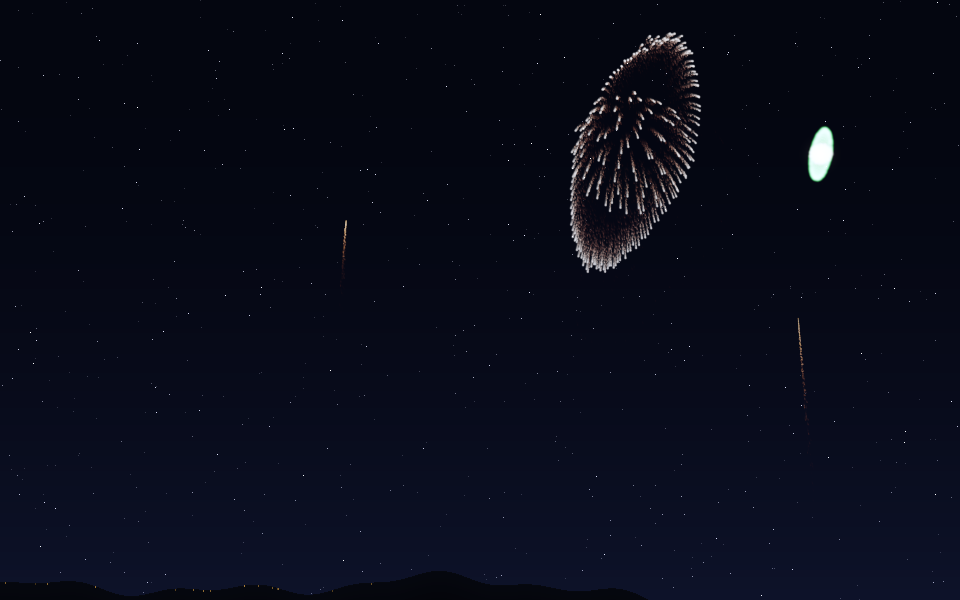
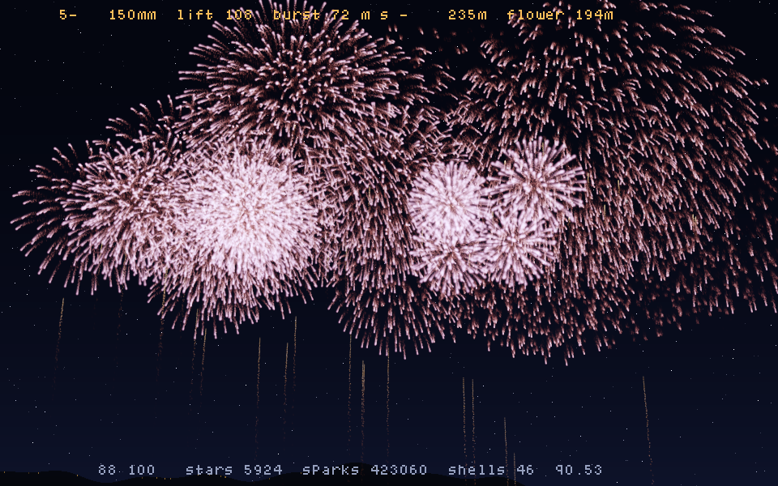
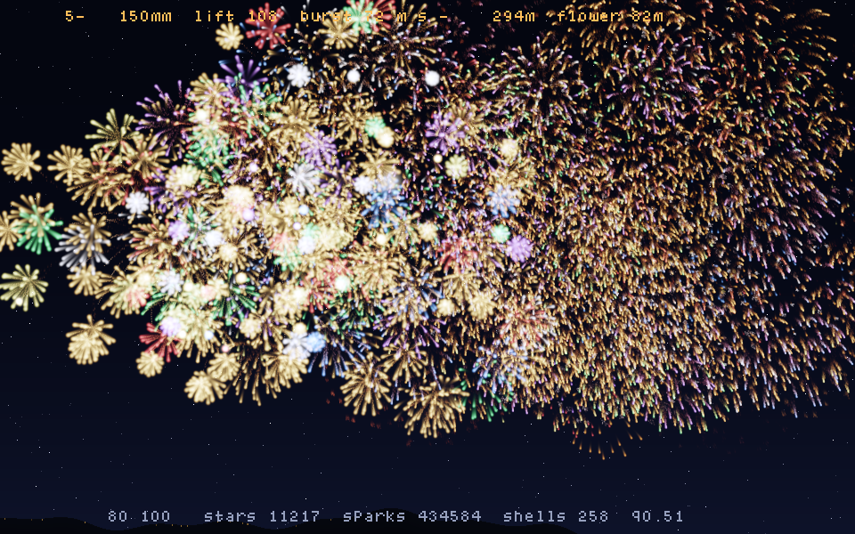

# hanabi_emu_cpp

打ち上げ花火（菊）のシミュレータ。**本物の花火玉に詰まっている「星」を一つ一つ**計算します。
計算も描画もすべて C++（レンダリングは [olive.c](https://github.com/tsoding/olive.c) と自前の HDR 加算バッファ）で、
Emscripten で WASM にして走らせます。作りは [universe_cpp](https://github.com/yomei-o/universe_cpp) と同じ ABI・同じハーネス。

## ▶ WASM デモ

### **https://yomei-o.github.io/hanabi_emu_cpp/wasmdist/hanabi_os/**

**🎆 スターマイン**ボタンで花火大会のクライマックス（既定 100 連発）。
**放っておいても 2 分おきに勝手に始まります**（間隔はスライダで変更、0 で自動オフ）。
クリックでその位置から 1 発打ち上げ。




## 何をシミュレーションしているか

入力は**火薬が与える初速と導火線の秒時だけ**です。到達高度も開花直径も、
表から読んだ値ではなく**毎ステップの差分計算（積分）の結果として出てきます**。
解析解も逆算ソルバも使っていません（アニメーションなので全部逐次差分）。

### 1. 打揚（うちあげ）
臼砲の打揚薬が玉に初速 v₀ を与える。以後は球体としての二次空気抵抗＋重力で減速：

```
F = -½ ρ Cd A |v| v  - m g ŷ
k = ½ ρ Cd A / m                      (弾道係数, 玉は燃えないので一定)
v ← v + (-k|v|v - g ŷ) dt,   x ← x + v dt
```

昇り曲導の火の粉を曳きながら上がり、**到達高度は積分の結果**（5号で実測 233m）。

### 2. 開発（かいはつ）
**時限導火線**が `fuse ← fuse - dt` で焼け、0 になった瞬間に割薬が働く。
実物と同じく必ずしも頂点ちょうどではなく、少し手前／少し後ろでも開く。

### 3. 星（ほし）
玉皮の内側に一層（芯入りなら多層）詰められた星が球面状に飛散。
方向は**フィボナッチ球**で等方に配り、玉ごとにランダム回転、初速には数 % のばらつき（玉込めの誤差）。

星は**表面燃焼**するので半径 r が線形に減り、質量・断面積・弾道係数が刻々変わります：

```
m = ρs (4/3)π r³,  A = π r²
k = ½ ρ Cd A / m = 0.8636 / (4 ρs r)     ← r に反比例して増える
r ← r - (r₀/T_burn) dt
```

**小さくなるほど急減速する**——これが菊の「勢いよく開いて、止まって、垂れる」形を作ります。
輝度は燃焼表面積 (r/r₀)² に比例させているので、消え際が自然に暗くなります。

### 4. 引先（ひきさき＝尾）
菊の尾は、星から剥がれ落ちて燃えている燃えかすそのもの。**実粒子として飛ばしています**。
半径 0.3mm 程度の粒は k ≈ 0.3 と抗力が桁違いに大きく、放出直後にほぼ空気に対して静止し、
その場で燃えながら重力でゆっくり垂れる。これが空間に軌跡として残ります（1発あたり数万粒）。

### 5. 描画
粒子は float の HDR 加算バッファに加算合成し、`x/(1+x)` でトーンマップして夜空に合成。
残光（バッファの減衰率）はスライダで調整可。カメラはピンホール投影で、
地平線が画面下端・花の頂点が画面上端に来るよう焦点距離とピッチ角を号数から決めます。

### 6. 玉の種類
**見た目を描いているのではなく、星に与える物理量と配置を変えているだけ**です。

| 玉種 | 星初速 | 燃焼時間 | 剥離量 | しくみ |
|---|---|---|---|---|
| 菊 | ×1.0 | ×1.0 | ×1.0 | 基本形。長い引先を曳く |
| 牡丹 | ×1.10 | ×0.75 | ×0 | 尾なし。点の集まりで開く |
| 柳 | ×0.48 | ×1.95 | ×1.7 | 低速・長燃焼で垂れ下がる |
| **蜂** | ×0.50 | ×1.45 | ×0.85 | **星が推力を出し、その向きが回る**（下記） |
| **渦蜂** | ×0.90 | **×0.34** | ×1.60 | 星が中心のまわりを回りながら飛ぶ。回転が落ちて輪が開く |
| **千輪** | — | — | — | 星ではなく**子玉**を撒き、遅れて一斉に小さく開く |
| **型物** | ×1.0 | ×0.68 | ×0.24 | 星を**観客を向いた平面に形どおり**並べる |

#### 蜂（ねずみ花火のようにクルクル回る星）
星にノズルが付いていて推力を出し、そのノズルの向きが軸まわりに回る、というだけ。

```
推力方向 = u cos θ + w sin θ      (u ⊥ w ⊥ 回転軸)
θ ← θ + ω dt                      ← 位相も差分で進める
a  += (T r/r₀) × 推力方向          ← 燃え尽きるにつれ推力も落ちる
```

ω が速すぎると推力が打ち消し合ってブルブル震えるだけになる。**0.1〜1回転/秒**にすると
はっきりした輪を描いて飛ぶ。星ごとに軸・推力・回転速度・向きがバラバラなので、
全部が思い思いの方向へクルクル飛んでいく。星数は少なめ（×0.38）にして1本1本の軌跡を見せる。



#### 渦蜂 — 蜂のもう一種類（回り方の仕組みが違う）
蜂が「推力の**向き**が回る」のに対し、渦蜂は **星そのものが中心のまわりを回りながら飛ぶ**。
`x,y,z` は回る中心（こちらは普通の星と同じ弾道）で、星はその中心を半径 R で周回する。
ノズルの推力が向心力そのものなので

```
推力 = R ω²            →  R = 推力/ω²
dω/dt = -B |ω| ω        ←  回転は空気抵抗で落ちる(これも差分)
θ ← θ + ω dt
星の位置 = 中心 + R (u cos θ + w sin θ)
火の粉の速度 = 中心の速度 + R ω (-u sin θ + w cos θ)   ← 接線方向
```

点火直後は 42〜68 rad/s（**7〜11回転/秒**）で速く回るので **輪は小さく締まっている**。
回転が落ちるにつれ R = 推力/ω² が効いて **輪がだんだん開いていく**。
燃え尽きるまでに 3〜4 周ぶん巻くので、軌跡がはっきりした渦になる。

回転が速いと 1 サブステップ（1/240 秒）で位相がかなり進むので、火の粉は
**そのサブステップ内の円弧上に位相を補間して撒いて**いる。これをやらないと軌跡が点線になる。
しかも推進薬を推力と回転に使い切るので **燃焼は 1.6 秒ほどと短く、光る時間も短い**。
回転軸・向き・速さは玉全体で共有するので、渦の向きが揃った独特の絵になる。



#### 千輪
親玉が開くと星の代わりに **9+4×号数 個の子玉**を球面状に撒く。子玉は 1.5〜2.0 秒の短い秒時を
焼きながら小さな尾を曳いて飛び、散らばったところで一斉に小さな菊／牡丹になる。
子玉も同じ `Shell` 構造体で、親と同じ積分器をそのまま通る（`gen` で世代を区別するだけ）。



#### 型物（ハート・輪・土星）
星を球面ではなく、観客を向いた平面上に形の輪郭どおりに並べ、**中心からの距離に比例した速度**で
押し出す。形はそのまま相似に拡大していく。外側の星ほど速いので抗力で少しだけ形が崩れるのも実物と同じ。
土星は「3Dの小さな球（銀）＋寝かせて傾けた輪（金）」の組み合わせ。




そのほか、**芯は少し遅れて点火**（時差開発。飛んではいるが光らない暗飛行の時間を持つ）、
一部の玉は**消え際に分砲**（パチパチ）します。

### 7. スターマイン（早打ち連打）

スターマインは発数を装填して連打間隔を差分で消化するだけ。左右に掃引しながら小玉主体で上げ、
時々大玉、締めに大玉の菊が中央で開きます。秒時（時限導火線）にばらつきを持たせているので開発高度も揃いません。

連打が終わったら**余韻**。空に玉も星も無くなるのを待ち、そこから静寂の秒数（既定6秒）を数えてから
通常の単発に戻ります。締めの大玉が開ききる前に次が上がってしまわないように。

**自動スターマイン**（既定2分）。時計が進むのは**通常時だけ**で、連打中と余韻のあいだは止まります。
つまり間隔は「静かな時間の長さ」で測られるので、連打が長引いても次までの間が詰まりません。
おまかせなら毎回テーマが変わります。

#### テーマ
**1テーマ = 1種類**に揃えます。菊とハートが混ざると濁るので、揃えたほうが美しい。
「おまかせ」も混成ではなく、**連打を始めるたびにテーマを1つ引く**（1発ごとではなく連打ごとに確定）。

| テーマ | 中身 |
|---|---|
| 🎲 おまかせ | **打ち上げるたびに下から1つをランダムに選ぶ**（全種類を混ぜはしない） |
| 菊 | 色とりどりの菊だけ 100発 |
| 🌸 桜 | **ピンクの菊だけ** 100発 |
| 銀世界 | 銀の菊だけ 100発 |
| 牡丹 / 金の柳 | それぞれ 100発 |
| 蜂 / 渦蜂 | それぞれ 100発 |
| 千輪 | 100発（子玉が 250 個以上同時に開く） |
| 型物 | ハート・輪・土星をランダムに 100発 |

締めの大玉もテーマに従うので、桜なら最後は大きなピンクの菊で終わります。




粒子予算に対する負荷から引先の量を一次遅れで自動調整するので（これも差分式）、
何発打っても破綻せず、密度だけが緩やかに落ちます。100 連発のピークで星 5,000 個・火の粉 40 万粒ほど。

## 実測値（積分の結果）

| 号数 | 玉径 | 打揚初速 | 秒時 | 星初速 | 到達高度 | 開花直径 | 星数 |
|---|---|---|---|---|---|---|---|
| 3号 | 90mm | 105 m/s | 5.0s | 60 m/s | 約 170m | 約 120m | 91 |
| 5号 | 150mm | 108 m/s | 5.8s | 72 m/s | 233m | 187m | 216 |
| 10号(尺) | 300mm | 116 m/s | 7.6s | 104 m/s | 約 340m | 約 320m | 700 |

到達高度・開花直径は HUD にリアルタイムで実測表示されます。

## ビルド

```sh
EMSDK=~/emsdk ./build.sh hanabi_os        # -> wasmdist/hanabi_os/sim.js (+.wasm)
```

ネイティブ自己テスト（PNG を書き出す）:

```sh
clang++ -O3 -std=c++17 -I. src/hanabi_os.cpp -o hanabi   # C99 指定初期化子のため g++ ではなく clang
./hanabi 600 preview.png          # 単発
./hanabi 620 climax.png 100       # 4番目の引数 = スターマインの発数
./hanabi 500 uzu.png 0 4          # 5番目 = 玉の種類(-1おまかせ 0菊 1牡丹 2柳 3蜂 4渦蜂 5千輪 6♡ 7輪 8土星)
./hanabi 640 sakura.png 100 -1 2  # 6番目 = スターマインのテーマ(2=桜)
```

## 見る

```sh
cd wasmdist && python3 -m http.server 8000
# http://localhost:8000/hanabi_os/
```

クリックでその位置から打ち上げ。スライダで号数・星の数・芯の数・打上間隔・風速・引先の量・残光・連打の発数/間隔/余韻・自動スターマインの間隔を調整。

fps が落ちても経過時間ぶんだけ物理を進める（描画は1回、最大3ステップ/フレーム）ので、
連打中でもスローモーションになりません。

## ABI

universe_cpp と共通：`sim_init / sim_w / sim_h / sim_reset / sim_step / sim_render / sim_click / sim_set / sim_action`
に、状態を返す `sim_get(id)` を足しています。
JS 側は C++ が描いた RGBA バッファを `ImageData` で canvas に転送するだけ。

## ライセンス

- `olive.c` — MIT (tsoding/olive.c)
- `stb_image_write.h` — public domain
